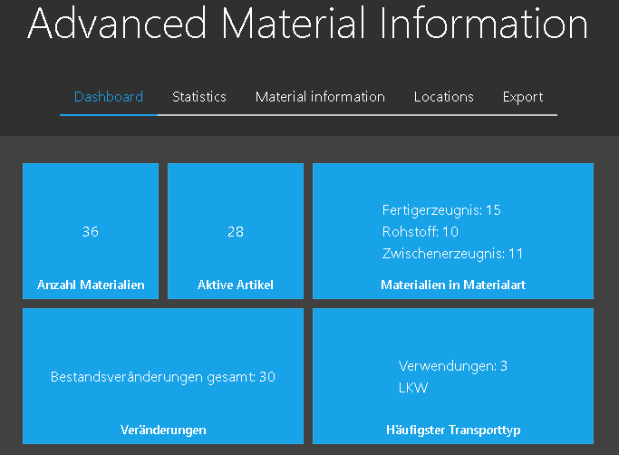
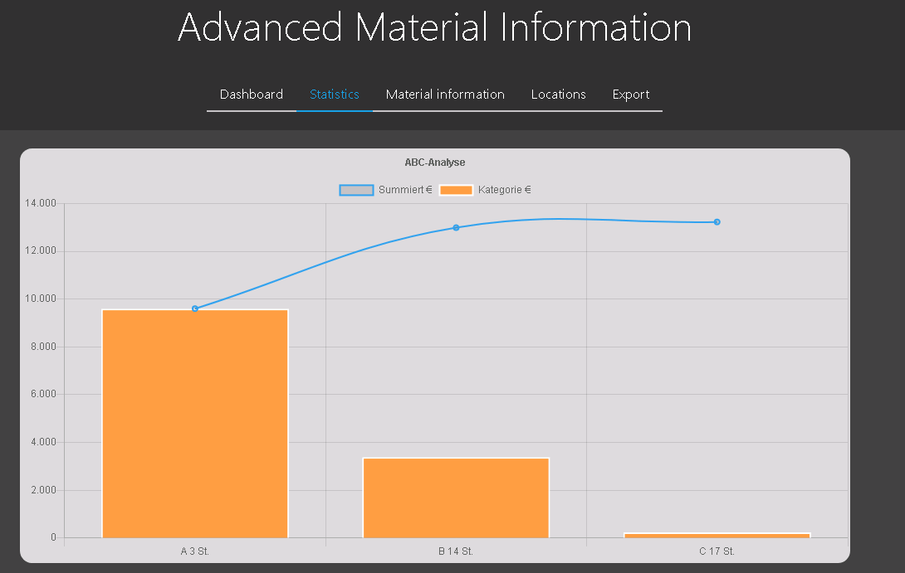
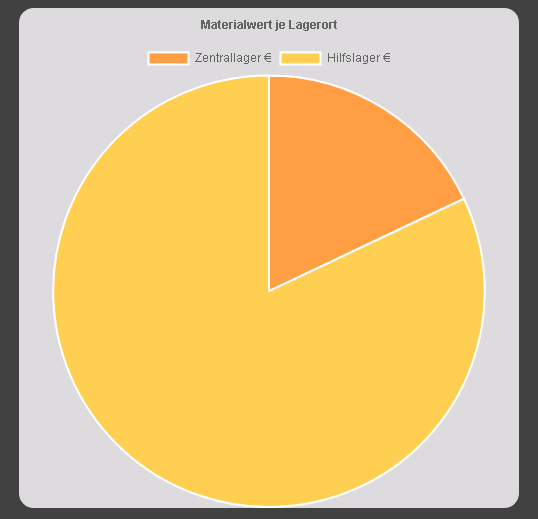
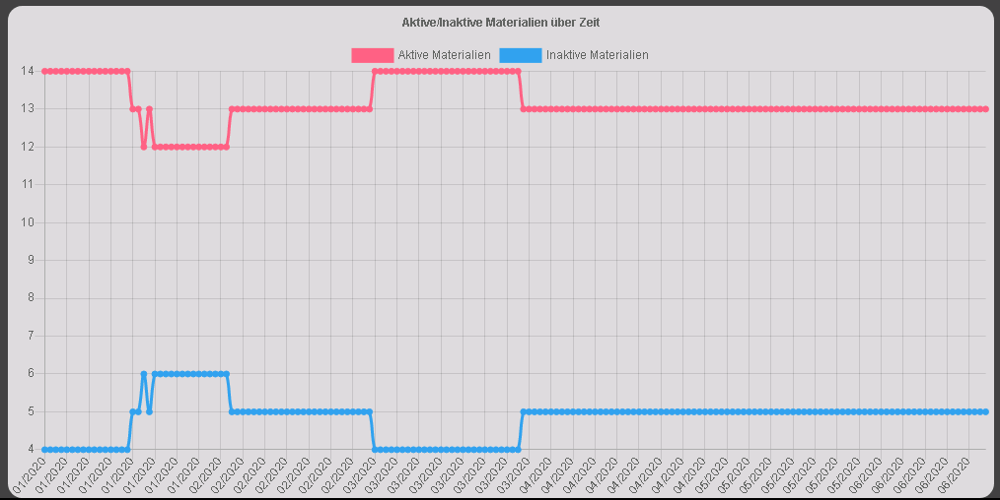
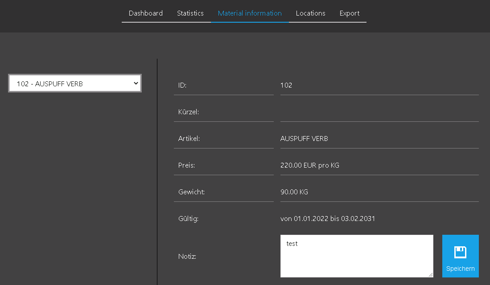
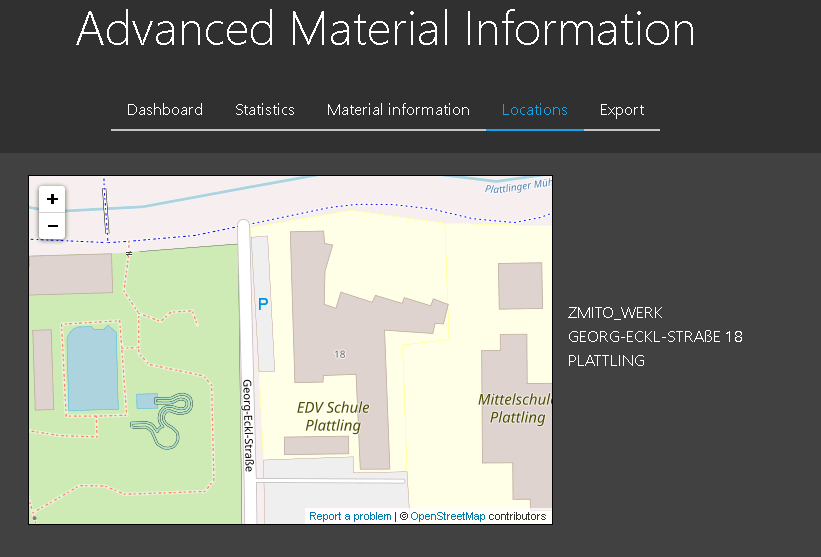
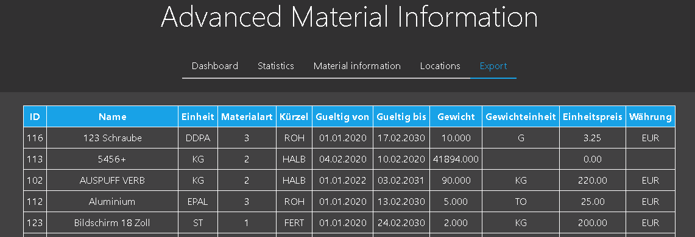
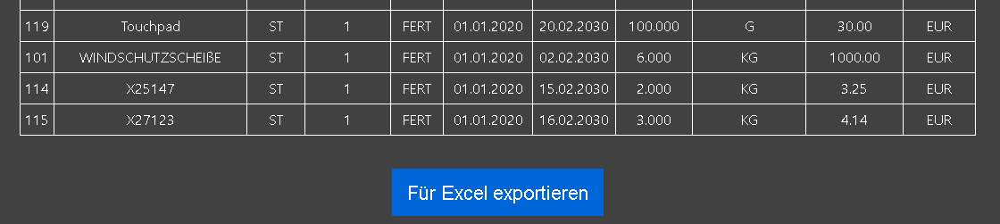

advanced material analytics
======

Usage
------
The advanced material analytics connects to a SAP Web Service and shows/edits some information of a own data model.
 
The advanced material analytics are used to

 - View a overview of some data
 
  
 - View some statistics of the data
 
  
 
  
 
  
 - View all materials in detail and add/edit material notes
 
  
 - View all factories on map and show addresses
 
  
 - View all material data as table and export all materials to .xlsx (MS Excel) file
 
  
 
  

Backend
------

The SAP side backend has the following table content

 - Currency
 - Location
 - Storage
 - Transport type
 - Condition
 - Unit
 - Material type
 - Material
 - Material condition
 - Material unit
 - Stock

The communication between front end and back end is realized with ODATA REST.
[relations model](exampleImg/TableDB.png)
Please notice that the table ZMITO_UEBERSETZUNG (translation) is not in use.

About this project
------
This web application was developed as it-school project in germany and tested with the Chrome browser.

License
------
Please consult the LICENSE file for details.
License files for the used free libraries can be found in the lib directory.

 - Chart.js [License](https://github.com/chartjs/Chart.js/blob/master/LICENSE.md)
 - FileSaver.js [License](https://github.com/eligrey/FileSaver.js/blob/master/LICENSE.md)
 - Metro [License](https://github.com/olton/Metro-UI-CSS/blob/master/LICENSE)
 - xlsx [License](https://github.com/SheetJS/sheetjs/blob/master/LICENSE)

 
